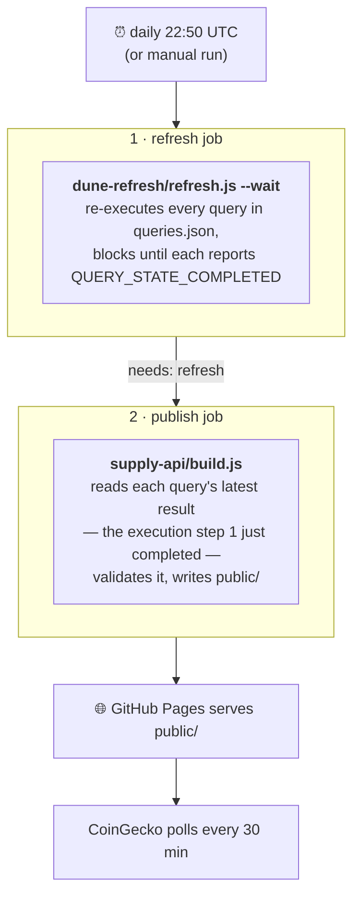

# TON supply API

The **public endpoint CoinGecko and other aggregators poll** to read TON's
circulating and total supply.

```console
$ curl https://tokamak-network.github.io/TON-total-supply/api/v1/supply/circulating.json
{"result":"64053126.526931055"}
```

There is **no server and no database here.** A GitHub Actions job reads the numbers
from Dune once a day, writes them as static JSON, and GitHub Pages serves them — so
there is no host that can go down and take TON's supply data off CoinGecko with it.

## Endpoints

Base URL: `https://tokamak-network.github.io/TON-total-supply`

| Endpoint | Meaning |
|---|---|
| [`/api/v1/supply/circulating.json`](https://tokamak-network.github.io/TON-total-supply/api/v1/supply/circulating.json) | **The figure CoinGecko reads.** total − staked − locked |
| [`/api/v1/supply/total.json`](https://tokamak-network.github.io/TON-total-supply/api/v1/supply/total.json) | 50,000,000 TON + block seigniorage − burned − unminted seigniorage |
| [`/api/v1/supply/circulating-upbit.json`](https://tokamak-network.github.io/TON-total-supply/api/v1/supply/circulating-upbit.json) | Upbit's convention: staked TON counted as circulating. **Not the one to give CoinGecko** |
| [`/api/v1/supply.json`](https://tokamak-network.github.io/TON-total-supply/api/v1/supply.json) | All figures plus provenance (Dune query links, execution timestamps) |

Every endpoint returns the same shape — a **decimal string**, mirroring CoinGecko's
own supply endpoint (`api.coingecko.com/api/v3/supply/eth`):

```json
{"result":"64053126.526931055"}
```

A string rather than a JSON number so no consumer can lose precision to float
parsing, and the fractional part is always present — CoinGecko requires supply
"with decimals included".

### Which number is which

TON has three defensible "circulating supply" figures, and picking the wrong one
misreports the token by tens of millions. As of 2026-07-14:

| Figure | Value | Excludes |
|---|---|---|
| `total` | 105,229,304 | — |
| `circulating` | 64,053,126 | staked + locked |
| `circulating-upbit` | 87,771,325 | locked only |

**CoinGecko uses `circulating`** — its published figure tracks this one, not the
Upbit variant. Upbit counts staked TON as circulating, hence the separate endpoint.

### Meeting CoinGecko's requirements

Checked against the live response — see
[CoinGecko's supply API requirements](https://support.coingecko.com/hc/en-us/articles/4499342867609):

| Requirement | Status |
|---|---|
| Simple REST endpoint, decimals included | ✅ `{"result":"64053126.526931055"}` |
| Publicly accessible, no authentication | ✅ no auth, no API key — the Dune key is used in CI, never at request time |
| Rate limit tolerating a poll every 30 min | ✅ static file on a CDN (`cache-control: max-age=600`); a 30-min poll is 48 requests/day |
| Not behind a CloudFlare WAF | ✅ `server: GitHub.com`, fronted by Fastly — CoinGecko's `X-Requested-With: com.coingecko` and `User-Agent: CoinGecko` headers are never challenged |

## How it works

The numbers come from the same Dune queries that back the
[Tokamak tokenomics dashboard](https://dune.com/tokamak-network/tokamak-network-tokenomics-dashboard),
which this repo already refreshes daily. This API is the layer that exposes that
existing pipeline publicly — it does not compute supply itself.

[`.github/workflows/dune-refresh.yml`](../.github/workflows/dune-refresh.yml) runs
two jobs, in order:



`publish` depends on `refresh` (`needs:`), and `refresh` **waits for completion**
rather than firing and forgetting. So the result `build.js` reads is the one the
refresh just produced — **the published page is always built from post-refresh
data.**

The one exception is deliberate: `publish` still runs if `refresh` **fails**. Dune
always returns a query's last *successful* execution, so a broken dashboard query —
say the expensive `Big Players` scan timing out — should not also block the supply
API from updating. In that case the figures are simply the previous run's, and if
that goes on too long the staleness check below stops publishing entirely.

### Fail-closed

CoinGecko publishes whatever we return, so `build.js` treats every doubt as a build
failure: it exits non-zero, the deploy step is skipped, and **the previously
published JSON stays live.** A stale-but-correct number beats a wrong one.

It refuses to publish when:

| Check | Why it matters |
|---|---|
| A Dune result is **older than 48h** | The worst failure mode. A query that quietly stops refreshing still returns a positive, self-consistent number, so nothing else would catch it — we would serve a months-old figure as current. The refresh runs daily, so 48h tolerates one missed run. |
| An endpoint's `queryId` is **not in [`../dune-refresh/queries.json`](../dune-refresh/queries.json)** | It would never be re-executed, so the endpoint would serve a frozen value forever. |
| An **invariant** is violated, or names an unknown endpoint | Catches a query silently returning the wrong column or a nonsense figure. An unknown name throws rather than skips — a safety net that quietly disappears is worse than none. |
| A value is missing, non-numeric, or non-positive | — |

### Freshness

The numbers update **once a day**. Seigniorage accrues at 3.92 TON/block, so a
published figure lags reality by at most ~28,000 TON — about **0.03% of total
supply**. CoinGecko polls every 30 minutes and simply sees the same value between
rebuilds, which is normal for a supply endpoint.

Refreshing more often is possible but not free: the daily dashboard refresh already
consumes ~1,630 of the Dune Free plan's 2,500 monthly credits (~65%), leaving no
headroom to re-execute the supply queries on a shorter cycle. See the
[credit budget](../dune-refresh/README.md#cost-dune-credits).

## Adding or changing an endpoint

Edit [`endpoints.json`](endpoints.json):

```json
{
  "path": "circulating",          // → /api/v1/supply/circulating.json  ([a-z0-9-]+ only)
  "queryId": 3298417,             // Dune query that produces the number
  "column": "Circulating_Supply", // column to read from its result row
  "description": "..."            // shown on the landing page and in supply.json
}
```

The query must **also** be in [`../dune-refresh/queries.json`](../dune-refresh/queries.json)
so it gets re-executed daily. `build.js` enforces this and fails the build if you
forget.

Several endpoints may share one `queryId` (e.g. a query returning multiple columns);
each distinct query is fetched once and its row shared, so that costs no extra credits.

Declare how a new figure relates to the existing ones, so a bad Dune result can't
slip through unnoticed:

```json
"invariants": [
  { "lte": ["circulating", "circulating-upbit"], "because": "staked TON is excluded from `circulating` but counted as circulating by Upbit" }
]
```

## Running it

```bash
node supply-api/build.js
```

Fetches, validates, and writes `public/`. Exits non-zero without writing if anything
fails validation — the same behavior CI relies on. Needs `DUNE_API_KEY` (or
`DUNE_EXECUTE_API_KEY`) in the project-root `.env`; a result read costs ~1 Dune credit
per query.

To rebuild and redeploy **without** re-running the 16 dashboard queries (a landing-page
fix, or recovering a bad deploy): **Actions → _Dune daily refresh & supply API publish_
→ Run workflow → check `skip_refresh`**. A full refresh consumes most of the monthly
credit budget, so don't trigger one just to redeploy.

## Registering with CoinGecko

Submit the URLs via CoinGecko's
[supply disclosure form](https://support.coingecko.com/hc/en-us/articles/4499342867609):

- circulating → `https://tokamak-network.github.io/TON-total-supply/api/v1/supply/circulating.json`
- total → `https://tokamak-network.github.io/TON-total-supply/api/v1/supply/total.json`

CoinGecko's published figures should then track these values.

## Setup

Already configured; recorded here in case the repo is ever rebuilt.

- **GitHub Pages**: Settings → Pages → Build and deployment → **Source: GitHub Actions**.
  Without this the `publish` job fails at the deploy step.
- **Secret**: `DUNE_EXECUTE_API_KEY` (or `DUNE_API_KEY`) in Settings → Secrets and
  variables → Actions. Shared with the refresh job.
